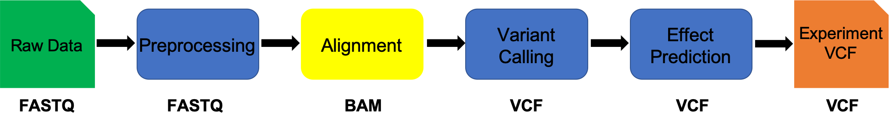
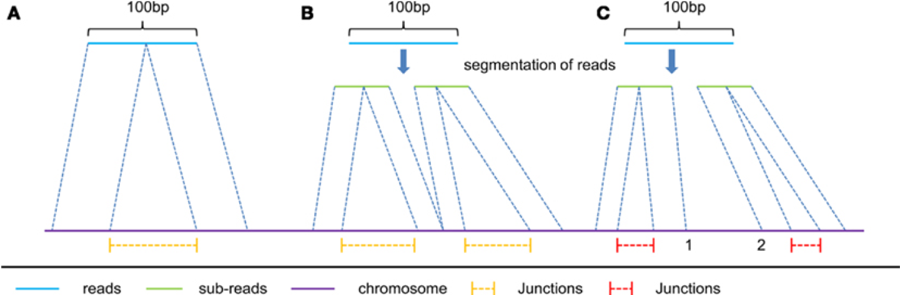
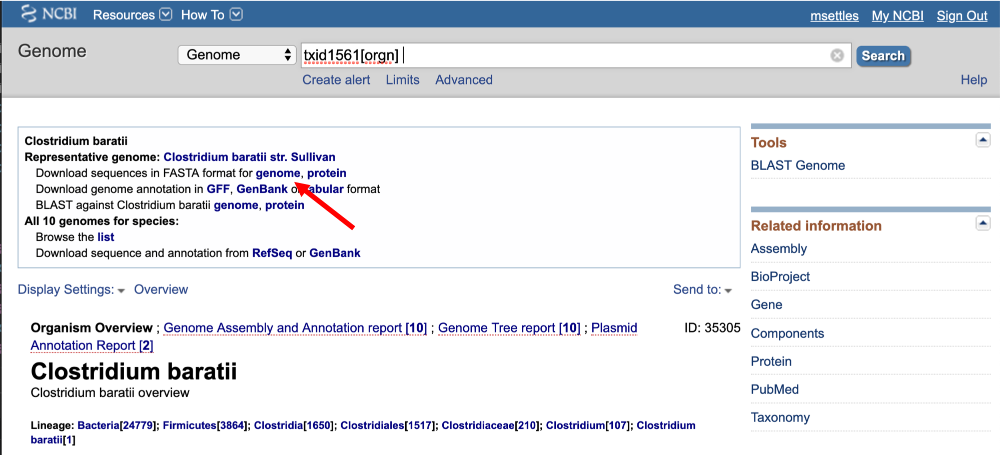
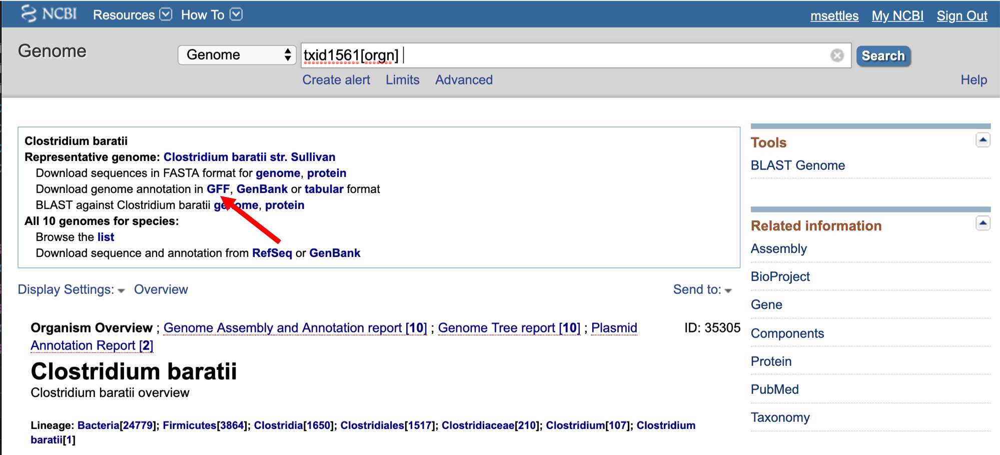

# Read mapping and alignment

This document assumes [preproc htstream](./preproc_htstream_Variants.md) has been completed.

**IF** for some reason it didn't finish, is corrupted or you missed the session, you can copy over from the flash drive



## Alignment vs Assembly

**Given sequence data**,

_Assembly seeks to put together the puzzle without knowing what the picture is._  

_Mapping tries to put together the puzzle pieces directly onto an image of the picture._

In mapping the question is more, given a small chunk of sequence, where in the genome did this piece most likely come from.

The goal then is to find the match(es) with either the “best” edit distance (smallest), or all matches with edit distance less than max edit dist. Main issues are:

* Large search space
* Regions of similarity (aka repeats)
* Gaps (INDELS)
* Complexity (RNA, transcripts)

#### Considerations
* Placing reads in regions that do not exist in the reference genome (reads extend off the end) [ mitochondrial, plasmids, structural variants, etc.].
* Sequencing errors and variations: alignment between read and true source in genome may have more differences than alignment with some other copy of repeat.
* What if the closest fully sequenced genome is too divergent? (3% is a common alignment capability)
* Placing reads in repetitive regions: Some algorithms only return 1 mapping; If multiple: map quality = 0
* Algorithms that use paired-end information => might prefer correct distance over correct alignment.

In RNAseq data, you must also consider effect of splice junctions, reads may span an intron.



### Aligners
Many [alignment algorithms](https://en.wikipedia.org/wiki/List_of_sequence_alignment_software
) to choose from.
* Aligners (global and local)
  * bwa-mem
  * Bowtie2 (global default, local possible)
* Spliced Aligners
  * STAR
  * HiSAT2 (formerly Tophat [Bowtie2])
  * GMAP - GSNAP
  * SOAPsplice
  * MapSplice
* Pseudo-Aligners (transcriptomes)
  * salmon
  * kalisto

#### Pseudo-aligners
* Quasi-mapping
* Probabilistic
* Map to transcripts, not genome
* Does transcript quantifications (or gene)
* Blazing FAST and can run on most laptops
* Experience suggests differences between “traditional” mappers are in the low abundance genes.

### Genome and Genome Annotation

Genome sequence fasta files and annotation (gff, gtf) files go together! These should be identified at the beginning of analysis.
* Genome fasta files should include all primary chromosomes, unplaced sequences
and un-localized sequences, as well as any organelles. Should bet contain any
contigs that represent patches, or alternative haplotypes.
* If you expect contamination, or the presence of additional sequence/genome,
add the sequence(s) to the genome fasta file.
* Annotation file should be GTF (preferred), and should be the most
comprehensive you can find.
  * Chromosome names in the GTF must match those in the fasta file (they don’t always do).

### Alignment concepts

* Multimappers:
  * Reads that align equally well to more than one reference location.
  * Generally, multimappers are discounted in variant detection, and are often discounted in counting
applications (like RNA-Seq ... would “cancel” out anyway).
  * Note: multimapper “rescue” in some algorithms (RSEM, Express?).
* Duplicates:
  * Reads or read pairs arising from the same original library fragment, either during library preparation (PCR duplicates).
  * Generally, duplicates can only be detected reliably with paired-end sequencing. If PE, they’re discounted in variant detection, and discounted in counting applications (like RNA-Seq).
* Clipping vs Splicing  
  
* Inner length, insert size, fragment length  
  
*From https://www.biostars.org/p/106291/

## Indexing a Reference sequence and annotation

**1\.** First lets make sure we are where we are supposed to be and create a
References directory.

    cd ~/variant_example
    mkdir Reference
    cd Reference

---
**2\.** To align our data we will need the genome (fasta) and annotation (gff) for Clostridium baratii str. Sullivan. There are many places to find them, but we are going to get them from the [NCBI](ftp://ftp.ncbi.nlm.nih.gov).

Then the url for the genome fasta.




We need to first get the url for the annotation gff.



**3\.** We are going to use an aligner called ['BWA MEM'](https://github.com/lh3/bwa) to align the sequence reads, but first we need to index the genome for BWA. Lets pull down a shell script to index the genome.

    cd ~/variant_example
    curl https://raw.githubusercontent.com/ucdavis-bioinformatics-training/2019-Alliance-for-Global-Health-and-Science-Makerere-University_Variants/master/scripts/bwa_index_wks_Variants.sh > bwa_index_wks_Variants.sh
    less bwa_index_wks_Variants.sh

 When you are done, type "q" to exit.

 ```bash
 #!/bin/bash

 ## assumes bwa is on the path

 start=`date +%s`
 echo $HOSTNAME

 outpath="Reference"
 [[ -d ${outpath} ]] || mkdir ${outpath}

 cd ${outpath}
 curl ftp://ftp.ncbi.nlm.nih.gov/genomes/all/GCF/000/789/395/GCF_000789395.1_ASM78939v1/GCF_000789395.1_ASM78939v1_genomic.fna.gz > GCF_000789395.1_ASM78939v1_genomic.fna.gz
 gunzip GCF_000789395.1_ASM78939v1_genomic.fna.gz
 FASTA="GCF_000789395.1_ASM78939v1_genomic.fna"

 curl ftp://ftp.ncbi.nlm.nih.gov/genomes/all/GCF/000/789/395/GCF_000789395.1_ASM78939v1/GCF_000789395.1_ASM78939v1_genomic.gff.gz > GCF_000789395.1_ASM78939v1_genomic.gff.gz
 gunzip GCF_000789395.1_ASM78939v1_genomic.gff.gz
 GFF="GCF_000789395.1_ASM78939v1_genomic.gff"

 call="bwa index ${FASTA}"

 echo $call
 eval $call

 end=`date +%s`
 runtime=$((end-start))
 echo $runtime
 ```

1. The script uses curl to download the fasta and GFF files from NCBI using the links you found earlier.
1. Uncompresses them using gunzip.
1. Creates the bwa index  

    cd ~/variant_example  
    bash bwa_index_wks_Variants.sh > scriptout./bwa_index.out 2> script_out/bwa_index.err  


This step will take a seconds.

**IF** for some reason it didn't finish, is corrupted, or you missed the session, you can copy over from the flash drive.

## Alignments

**1\.** We are now ready to try an alignment. Let's create an output directory for BWA:


    cd ~/variant_example/HTS_testing


and let's run bwa on the pair of hstream streamed test files we created earlier.

Then run the bwa command (Its on multiple lines for readability)

    bwa mem \
    -t 2 \
    -R '@RG\tID:sample1.streamed\tSM:sample1.streamed\tPL:ILLUMINA\tDS:Paired' \
    ../Reference/GCF_000789395.1_ASM78939v1_genomic.fna  \
    sample1.streamed_R1.fastq.gz sample1.streamed_R2.fastq.gz | \
    samtools sort -m 768M --threads 2 -o sample1.streamed_bwa.bam -


In the command, we are telling bwa to map reads to the genome using 2 threads, and providing a RG tag (see [filetype.md](./filetypes.md)), __piping__ to samtools sort (max mem 768M and threads 2), the name for the output file will be sample1.streamed_bwa.bam.

## Running BWA on the experiment

**1\.** We can now run BWA across all samples on the real data using a shell script, [bwa_wks_Variants.sh](../scripts/bwa_wks_Variants.sh), that we should take a look at now.

    cd ~/variant_example  # We'll run this from the main directory
    curl https://raw.githubusercontent.com/ucdavis-bioinformatics-training/2019-Alliance-for-Global-Health-and-Science-Makerere-University_Variants/master/scripts/bwa_wks_Variants.sh > bwa_wks_Variants.sh
    less bwa_wks_Variants.sh

When you are done, type "q" to exit.


```bash
#!/bin/bash
#

start=`date +%s`
echo $HOSTNAME


THREADS=4
MAPTHREADS=$(expr ${THREADS} - 2)
SORTTHREADS=$(expr ${THREADS} - ${MAPTHREADS})

inpath=01-HTS_Preproc

outpath='02-BWA'
[[ -d ${outpath} ]] || mkdir ${outpath}

mapfasta=./Reference/GCF_000789395.1_ASM78939v1_genomic.fna

for sample in `cat samples.txt`
do

    r1=${inpath}/${sample}/${sample}_R1.fastq.gz
    r2=${inpath}/${sample}/${sample}_R2.fastq.gz
    se=${inpath}/${sample}/${sample}_SE.fastq.gz

    [[ -d ${outpath}/${sample} ]] || mkdir ${outpath}/${sample}

    echo "SAMPLE: ${sample}"

    output=${outpath}/${sample}/${sample}_bwa.bam

    call="bwa mem -t ${MAPTHREADS} \
      -R '@RG\tID:${sample}\tSM:${sample}\tPL:ILLUMINA\tDS:Paired' \
      ${mapfasta} ${r1} ${r2} | \
      samtools sort -m 768M --threads ${SORTTHREADS} -o ${output}-pe -"
    echo $call
    eval $call

    call="bwa mem -t ${MAPTHREADS} \
      -R '@RG\tID:${sample}\tSM:${sample}\tPL:ILLUMINA\tDS:Paired' \
      ${mapfasta} ${se} | \
      samtools sort -m 768M --threads ${SORTTHREADS} -o ${output}-se -"
    echo $call
    eval $call

    call="samtools merge -f -@ ${THREADS} ${output} ${output}-pe ${output}-se"
    echo $call
    eval $call

    call="samtools index -@ ${THREADS} ${output}"
    echo $call
    eval $call

    call="samtools idxstats ${output} > ${output}.idxstats"
    echo $call
    eval $call

    call="samtools flagstat -@ ${THREADS} ${output} > ${output}.flagstat"
    echo $call
    eval $call

    call="samtools stats -@ ${THREADS} ${output} > ${output}.stats"
    echo $call
    eval $call

done

end=`date +%s`

runtime=$((end-start))

echo $runtime
```

Because in preprocessing we overlapped reads, we have both single-end and paired-end reads. We need to process these separately and then merge (using samtools merge) the results. In addition to mapping and merging, we will also use samtools to index, idxstats, flagstats and stats. Take a quick look at the help documentation for these apps.


    samtools merge  
    samtools index  
    samtools idxstats  
    samtools flagstats  
    samtools stats  


After looking at the script, lets run it.

    bash bwa_wks_Variants.sh > scriptout/bwa.out 2> scriptout/bwa.err # moment of truth!

Takes about 15 minutes to run all samples.

## Quality Assurance - Mapping statistics as QA/QC.

**1\.** Once your jobs have finished successfully (check the error and out logs like we did in the previous exercise), use a script of ours, [bwa_stats_wks_Variants.R](../scripts/bwa_stats_wks_Variants.R) to collect the alignment stats. Don't worry about the script's contents at the moment. For now:

    cd ~/variant_example  # We'll run this from the main directory
    curl https://raw.githubusercontent.com/ucdavis-bioinformatics-training/2019-Alliance-for-Global-Health-and-Science-Makerere-University_Variants/master/scripts/bwa_stats_wks_Variants.R > bwa_stats_wks_Variants.R

    R CMD BATCH bwa_stats_wks_Variants.R
    cat bwa_stats.txt

Open in excel (or excel like application), you may have to move the header column 1 cell to the right, and lets review.

Are all samples behaving similarly? Discuss ...


Once we are satisfied the data look good, lets remove the pre-merged bam files that at in pe and se.


    cd ~/variant_example  # We'll run this from the main directory
    rm -rf 02-BWA/*/*-pe 02-BWA/*/*-se


## Scripts

shell script for indexing the genome

[bwa_index_wks_Variants.sh](../scripts/bwa_index_wks_Variants.sh)

shell script for mapping using bash loop and bwa.

[bwa_wks_Variants.sh](../scripts/bwa_wks_Variants.sh)

shell script to produce summary mapping table

[bwa_stats_wks_Variants.R](../scripts/bwa_stats_wks_Variants.R)
