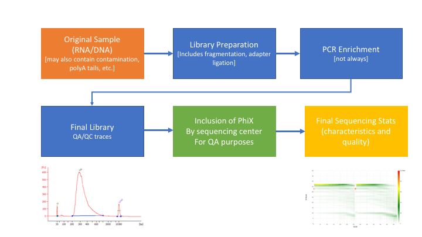

# Sequence preprocessing

This document assumes [project_setup](./project_setup.md) has been completed.


## Why preprocess reads

We have found that aggressively “cleaning” and processing reads can make a large difference to the speed and quality of mapping and assembly results. Cleaning your reads means, removing reads/bases that are:
  * Unwanted sequence
  * artificially added onto sequence of primary interest (vectors, adapters, primers)
  * join short overlapping paired-end reads
  * low quality bases
  * originate from PCR duplication
  * not of primary interest (contamination)

Preprocessing also produces a number of statistics that are technical in nature that should be used to evaluate “experimental consistency”.

**Many read preprocessing strategies over time**

* Identify and remove contaminant and vector reads.
  * Reads which appear to fully come from extraneous sequence should be removed.
* Quality trim/cut.
  * “End” trim a read until the average quality > Q (Lucy).
  * Remove any read with average quality < Q.
* Eliminate singletons/duplicates.
  * If you have excess depth of coverage, and particularly if you have >> x-fold coverage where x is the read length, then eliminating singletons is a nice way of dramatically reducing the number of candidate error-prone reads.
  * Reads which appear the same (particularly paired-end) are often more likely PCR duplicates and therefor redundant reads.
* Eliminate all reads (pairs) containing an “N” character.
  * If you can afford the loss of coverage, you might throw away all reads containing Ns.
* Identify and trim off adapter and barcodes if present.
  * Believe it or not, the software provided by Illumina, either does not look for (default), or does a mediocre job of, identifying adapters and removing them.

** Many technical things happen between original sample and data, preprocessing is working backwards through that process to get as close as we can to original sample **



## DNA preprocessing workflow

1. Remove contaminants (at least PhiX).
1. Remove PCR duplicates.
1. Join and potentially extend, overlapping paired end reads
1. If reads completely overlap they will contain adapter, remove adapters
1. Identify and remove any adapter dimers if present
1. Trim sequences (5’ and 3’) by quality score (I like Q20)
1. Cleanup
  * Remove any reads that are less then the minimum length parameter
  * Produce preprocessing statistics

## HTStream - preprocessing application

Can be downloaded from [here](https://github.com/ibest/HTStream). Fast C++ implementation, designed to have discreet applications that can be pipelined together using unix piping. We hope in the long run to include any and all needed preprocessing routines. Includes:

* hts_AdapterTrimmer - identify and remove adapter sequences
* hts_NTrimmer - extract the longest subsequence with no Ns
* hts_PolyATTrim - identify and remove polyA/T sequence (least robust algorithm)
* hts_SeqScreener - identify and remove/keep/count contaminants (default phiX)
* hts_SuperDeduper - identify and remove PCR duplicates
* hts_CutTrim - discreet 5' and/or 3' basepair trimming
* hts_Overlapper - Overlap paired end reads (cutting off adapters when present)
* hts_QWindowTrim - 5' and/or 3' prime quality score trimming using windows
* hts_Stats - compute read stats

**1\.** Let's run the first step of our HTStream preprocessing pipeline, which is always to gather basic stats on the read files. For now, we're only going to run one sample through the pipeline.

**1a\.** So let's first take a small subsample of reads, just so our trial run through the pipeline goes really quickly.

    cd ~/variant_example
    mkdir HTS_testing
    cd HTS_testing
    gunzip -c ../00-RawData/sample1/sample1_R1.fastq.gz | head -100000 | gzip > sample1.subset_R1.fastq.gz
    gunzip -c ../00-RawData/sample1/sample1_R2.fastq.gz | head -100000 | gzip > sample1.subset_R2.fastq.gz
    ls

So we gunzip (uncompress and send to screen), pipe to head (param -100000) then pipe to gzip to recompress and name our files subset.

*How many reads are we going to analyze in our subset?*

**1b\.** Now we'll run our first preprocessing step ... hts_Stats, first loading the module and then looking at help.

    cd ~/variant_example/HTS_testing
    hts_Stats --help

```bash
# (base) biomsettles:HTS_testing mattsettles$     hts_Stats --help
# HTStream <https://github.com/ibest/HTStream> application: hts_Stats
# Version: 1.1.0-release
# The hts_Stats app produce basic statistics about the reads in a dataset.
#   Including the basepair composition and number of bases Q30.
#
# Standard Options:
#   -v [ --version ]                      Version print
#   -h [ --help ]                         Prints help documentation
#   -N [ --notes ] arg                    Notes for the stats JSON
#   -L [ --stats-file ] arg (=stats.log)  String for output stats file name
#   -A [ --append-stats-file ]            Append to stats file
#
# Input Options [default: tab6 format on stdin]:
#   -1 [ --read1-input ] arg              Read 1 paired end fastq input <space
#                                         separated for multiple files>
#   -2 [ --read2-input ] arg              Read 2 paired end fastq input <space
#                                         separated for multiple files>
#   -U [ --singleend-input ] arg          Single end read fastq input <space
#                                         separated for multiple files>
#   -T [ --tab-input ] arg                Tab-delimited (tab6) input <space
#                                         separated for multiple files>
#   -I [ --interleaved-input ] arg        Interleaved fastq input <space
#                                         separated for multiple files>
#   -S [ --from-stdin ]                   DEPRECATED PARAMETER
#
# Output Options [default: tab6 format to stdout]:
#   -F [ --force ]                        Forces overwrite of files
#   -u [ --uncompressed ]                 Output uncompressed (not gzipped) files
#   -f [ --fastq-output ] arg             Output to Fastq files <PE AND/OR SE
#                                         files>
#   -i [ --interleaved-output ] arg       Output to interleaved fastq files
#                                         <INTERLEAVED PE AND/OR SE files>
#   -t [ --tab-output ] arg               Output to tab-delimited (tab6) file
#   -z [ --unmapped-output ] arg          Output to unmapped sam file
#   -p [ --prefix ]                       DEPRECATED PARAMETER
#   -g [ --gzip-output ]                  DEPRECATED PARAMETER
#   -O [ --to-stdout ]                    DEPRECATED PARAMETER
#
#
# Please report any issues, request for enhancement, or comments to <https://github.com/ibest/HTStream/issues>
```

So now lets run hts_Stats and look at the output.

    hts_Stats -1 sample1.subset_R1.fastq.gz \
              -2 sample1.subset_R2.fastq.gz \
              -L sample1.stats.log -f sample1.stats

*What parameters did we use, what do they do?*

Lets take a look at the output of stats

    ls -lah

```bash
# (base) biomsettles:HTS_testing mattsettles$     ls -lah
# total 41224
# drwxr-xr-x  7 mattsettles  staff   224B Jul 25 17:19 .
# drwxr-xr-x  6 mattsettles  staff   192B Jul 25 17:18 ..
# -rw-r--r--  1 mattsettles  staff   647B Jul 25 17:19 sample1.stats.log
# -rw-r--r--  1 mattsettles  staff   4.2M Jul 25 17:19 sample1.stats_R1.fastq.gz
# -rw-r--r--  1 mattsettles  staff   4.8M Jul 25 17:19 sample1.stats_R2.fastq.gz
# -rw-r--r--  1 mattsettles  staff   4.2M Jul 25 17:18 sample1.subset_R1.fastq.gz
# -rw-r--r--  1 mattsettles  staff   4.8M Jul 25 17:18 sample1.subset_R2.fastq.gz
```

*Which files were generated from hts\_Stats?*

*Lets look at the file sample1.stats\.log*

    cat sample1.stats.log

The logs generated by htstream are in [json](https://en.wikipedia.org/wiki/JSON) format, like a database format but meant to be readable.

```json
{ "hts_Stats_22297": {
    "Notes": "",
    "totalFragmentsInput": 25000,
    "totalFragmentsOutput": 25000,
    "R1_readlength_histogram": [ [300,25000] ],
    "R2_readlength_histogram": [ [300,25000] ],
    "Base_composition": {
        "A": 5123307,
        "C": 2544933,
        "G": 2343290,
        "T": 4988470,
        "N": 0
    },
    "Single_end": {
        "SE_in": 0,
        "SE_out": 0,
        "SE_bpLen": 0,
        "SE_bQ30": 0
    },
    "Paired_end": {
        "PE_in": 25000,
        "PE_out": 25000,
        "R1_bpLen": 7500000,
        "R1_bQ30": 6485040,
        "R2_bpLen": 7500000,
        "R2_bQ30": 5985436
    }
  }
}
```

**2\.** The power of htstream is the ability to stream reads through multiple programs using pipe's.

By streaming reads through programs processing will be much quicker, each read is read in only once (written only once), and use significantly less storage as there are no intermediate files. It can do this by streaming a tab-delimited format called tab6, one line per read or read pair.

Single end reads are 3 columns:

`read1id  read1seq  read1qual`

Paired end reads are 6 columns:

`read1id  read1seq  read1qual  read2id  read2seq  read2qual`

So lets first run hts_Stats and then hts_SeqScreener (Check for PhiX) in a streamed fashion.

    cd ~/variant_example/HTS_testing

    hts_Stats -1 sample1.subset_R1.fastq.gz \
              -2 sample1.subset_R2.fastq.gz \
              -L sample1.streamed.log |
    hts_SeqScreener -A -L sample1.streamed.log \
              -f sample1.streamed

Note the pipe between the two applications!

*What new parameters did we use here?*

*Lets look at the file sample1.streamed.log?*

```json
{ "hts_Stats_22390": {
    "Notes": "",
    "totalFragmentsInput": 25000,
    "totalFragmentsOutput": 25000,
    "R1_readlength_histogram": [ [300,25000] ],
    "R2_readlength_histogram": [ [300,25000] ],
    "Base_composition": {
        "A": 5123307,
        "C": 2544933,
        "G": 2343290,
        "T": 4988470,
        "N": 0
    },
    "Single_end": {
        "SE_in": 0,
        "SE_out": 0,
        "SE_bpLen": 0,
        "SE_bQ30": 0
    },
    "Paired_end": {
        "PE_in": 25000,
        "PE_out": 25000,
        "R1_bpLen": 7500000,
        "R1_bQ30": 6485040,
        "R2_bpLen": 7500000,
        "R2_bQ30": 5985436
    }
  }, "hts_SeqScreener_22391": {
    "Notes": "",
    "totalFragmentsInput": 25000,
    "totalFragmentsOutput": 23872,
    "inverse": 0,
    "record": 0,
    "Screen_info": {
        "screenBP": 5386,
        "lookupKmers": 5372
    },
    "Single_end": {
        "SE_in": 0,
        "SE_out": 0,
        "SE_hits": 0
    },
    "Paired_end": {
        "PE_in": 25000,
        "PE_out": 23872,
        "PE_hits": 1128
    }
  }
}
```

**3\.** A DNA preprocessing pipeline

1. hts_Stats: get stats on raw reads
1. hts_SeqScreener: screen out (remove) phiX
1. hts_SuperDeduper: identify and remove PCR duplicates
1. hts_Overlapper: identify and remove adapter sequence
1. hts_QWindowTrim: remove poor quality sequence
1. hts_NTrimmer: remove any remaining N characters
1. hts_CutTrim: use to remove all reads < 50bp
1. hts_Stats: get stats out output reads


**3a\.** Why screen for phiX?

PhiX is a common control in Illumina runs, and facilities may not tell you if/when PhiX has been spiked in since it does not have a barcode, so in theory should not be in your data.

However:
* When I know PhiX has been spiked in, I find sequence every time
    * [update] When dual matched barcodes are used, then near zero phiX reads identified.
* When I know PhiX has not been spiked in, I do not find sequence

For RNAseq and variant analysis (any mapping based technique) it is not critical to remove, but for sequence assembly it is. I think its better safe than sorry and screen for it every time.

**3b.** Removing PCR duplicates with hts_SuperDeduper.

Removing PCR duplicates can be **controversial** for RNAseq, but I'm in favor of it. It tells you alot about the original complexity of each sample and potential impact of sequencing depth.

__**However, I would never do PCR duplicate removal on single-end reads, without UMIs!**__


Super Deduper only uses a small portion of the reads to identify duplicates.


We calculated the Youden Index for every combination tested and the point that acquired the highest index value (as compared to Picard MarkDuplicates) occurred at a start position at basepair 5 and a length of 10bp (20bp total over both reads). Though defaults in hts_SuperDeduper are start position at basepair 10 and a length of 10bp.

**3c.** Adapter trimming by overlapping reads.

Consider the three scenarios below

**Insert size > length of the number of cycles**


hts_AdapterTrimmer product: original pairs

hts_Overlapper product: original pairs

**Insert size < length of the number of cycles (10bp min)**


hts_AdapterTrimmer product: original pairs

hts_Overlapper product: extended, single

**Insert size < length of the read length**


hts_AdapterTrimmer product: adapter trimmed, pairs

hts_Overlapper product: adapter trimmed, single

Both hts_AdapterTrimmer and hts_Overlapper employ this principle to identify and remove adapters for paired-end reads. For paired-end reads the difference between the two are the output, as overlapper produces single-end reads when the pairs overlap and adapter trimmer keeps the paired end format. For single-end reads, adapter trimmer identifies and removes adapters by looking for the adapter sequence, where overlapper just ignores single-end reads (nothing to overlap).

**3d.** Q-window trimming.

As a sequencing run progresses the quality scores tend to get worse, so its common to trim of the worst quality bases.


This is how reads commonly look, the start at "good" quality, increase to "excellent" and degrade to "poor", with R2 always looking worse (except when they don't) than R1 and get worse as the number of cycles increases.

hts_QWindowTrim trim 5' and/or 3' end of the sequence using a windowing (average quality in window) approach.

**4.** Lets put it all together

    hts_Stats -L sample1_htsStats.log -1 sample1.subset_R1.fastq.gz -2 sample1.subset_R2.fastq.gz | \
    hts_SeqScreener -A -L sample1_htsStats.log | \
    hts_SuperDeduper -e 1000 -A -L sample1_htsStats.log | \
    hts_AdapterTrimmer -n -A -L sample1_htsStats.log | \
    hts_QWindowTrim -n -A -L sample1_htsStats.log | \
    hts_NTrimmer -n -A -L sample1_htsStats.log | \
    hts_CutTrim -n -m 150 -A -L sample1_htsStats.log | \
    hts_Stats -A -L sample1_htsStats.log -f sample1.htstream

Note the patterns:
* In the first routine we use -1 and -2 to specify the original reads.
* In the final routine we use -f fastq prefix to write out new preprocessed reads.
* For the log, we specify -L with the same log file name for all routines, and use -A for the second routine onward to append to log output, generating a single log file at the end.
* All other parameters are algorithm specific, can review using --help

*Review the final json output, how many reads do we have left?*

*Confirm that number by counting the number of reads in the final output files.*

*How many adapters did we detect, cut off?*

*How many PCR duplicates were there?*

*Anything else interesting?*

---

**5\.** We can now run the preprocessing routine across all samples on the real data using a shell script, [hts_preproc_wks_Variants.sh](../scripts/hts_preproc_wks_Variants.sh), that we should take a look at now.

    cd ~/variant_example  # We'll run this from the main directory
    wget https://raw.githubusercontent.com/ucdavis-bioinformatics-training/2019-Alliance-for-Global-Health-and-Science-Makerere-University_Variants/master/scripts/hts_preproc_wks_Variants.sh
    less hts_preproc_wks_Variants.sh

 When you are done, type "q" to exit.

```bash
#!/bin/bash

## assumes htstream is available on the Path

start=`date +%s`
echo $HOSTNAME

outpath='01-HTS_Preproc'
[[ -d ${outpath} ]] || mkdir ${outpath}

for sample in `cat samples.txt`
do
  [[ -d ${outpath}/${sample} ]] || mkdir ${outpath}/${sample}
  echo "SAMPLE: ${sample}"

  call="hts_Stats -L ${outpath}/${sample}/${sample}_htsStats.log -1 00-RawData/${sample}/*R1* -2 00-RawData/${sample}/*R2* | \
        hts_SeqScreener -A -L ${outpath}/${sample}/${sample}_htsStats.log | \
        hts_SuperDeduper -e 250000 -A -L ${outpath}/${sample}/${sample}_htsStats.log | \
        hts_Overlapper -n -A -L ${outpath}/${sample}/${sample}_htsStats.log | \
        hts_QWindowTrim -n -A -L ${outpath}/${sample}/${sample}_htsStats.log | \
        hts_NTrimmer -n -A -L ${outpath}/${sample}/${sample}_htsStats.log | \
        hts_CutTrim -n -m 150 -A -L ${outpath}/${sample}/${sample}_htsStats.log | \
        hts_Stats -F -A -L ${outpath}/${sample}/${sample}_htsStats.log -f ${outpath}/${sample}/${sample}" > scriptout/htstream.out 2> scriptout/htstream.err
  echo $call
  eval $call
done

end=`date +%s`
runtime=$((end-start))
echo $runtime
```

After looking at the script, let's run it.

    bash hts_preproc_wks_Variants.sh > scriptout/htstream.out 2> scriptout/htstream.err # moment of truth!

---

## Quality Assurance - Preprocessing statistics as QA/QC.

Beyond generating "better" data for downstream analysis, cleaning statistics also give you an idea as to the original quality and complexity of the sample, library generation, and sequencing quality.

This can help inform you of how you might change your procedures in the future, either sample preparation, or in library preparation.

I’ve found it best to perform QA/QC on both the run as a whole (poor samples can affect other samples) and on the samples themselves as they compare to other samples (BE CONSISTENT).

Reports such as Basespace for Illumina, are great ways to evaluate the run as a whole, the sequencing provider usually does this for you.  
PCA/MDS plots of the preprocessing summary are a great way to look for technical bias across your experiment. Poor quality samples often appear as outliers on the MDS plot and can ethically be removed due to identified technical issues.

**1\.** Let's make sure that all jobs completed successfully.

Lets first check the "htstream.out" and "htstream.err" files:

    cd ~/variant_example
    cat scriptout/htstream.out

Look through the output and make sure you don't see any errors. Now do the same for the err files:

    cat scriptout/htstream.err

Also, check the output files. First check the number of forward and reverse output files (should be 16 each):

    cd 01-HTS_Preproc
    ls */*R1* | wc -l
    ls */*R2* | wc -l

Check the sizes of the files as well. Make sure there are no zero or near-zero size files and also make sure that the size of the files are in the same ballpark as each other:

    ls -lh *

If, for some reason something went wrong, please let one of us know and we will help.

**IF** for some reason it didn't finish, is corrupted or you missed the session, you can copy over a completed copy from the flash drive.

---

**2.** Let's take a look at the differences between the input and output files. First look at the input file:

    cd ~/variant_example
    zless 00-RawData/sample1/sample1_R1.fastq.gz

Let's search for the adapter sequence. Type '/' (a forward slash), and then type **AGATCGGAAGAGCACACGTCTGAACTCCAGTCAC** (the first part of the forward adapter). Press Enter. This will search for the sequence in the file and highlight each time it is found. You can now type "n" to cycle through the places where it is found. When you are done, type "q" to exit.

Now look at the output file:

    zless 01-HTS_Preproc/sample1/sample1_R1.fastq.gz

If you scroll through the data (using the spacebar), you will see that some of the sequences have been trimmed. Now, try searching for **AGATCGGAAGAGCACACGTCTGAACTCCAGTCAC** again. You shouldn't find it (adapters were trimmed remember), but rarely is anything perfect. You may need to use Control-C to get out of the search and then "q" to exit the 'less' screen.

Lets grep for the sequence and count occurrences

    gunzip -c  00-RawData/sample1/sample1_R1.fastq.gz | grep  AGATCGGAAGAGCACACGTCTGAACTCCAGTCAC | wc -l
    gunzip -c  01-HTS_Preproc/sample1/sample1_R1.fastq.gz | grep  AGATCGGAAGAGCACACGTCTGAACTCCAGTCAC | wc -l

*What is the reduction in adapters found?*

---

**3.** QA/QC Summary table of the json files.

I've created a small R script to read in each json file, pull out some relevant stats and write out a table for all samples.

    cd ~/variant_example  # We'll run this from the main directory
    wget https://raw.githubusercontent.com/ucdavis-bioinformatics-training/2019-Alliance-for-Global-Health-and-Science-Makerere-University_Variants/master/scripts/summarize_stats_Variants.R

    R CMD BATCH hts_preproc_stats_wks_Variants.R
    cat hts_preproc_stats.txt

Open in excel (or excel like application), you may have to move the header column 1 cell to the right, and lets review.

*Any problematic samples?*

*Anything else worth discussing?*

## Scripts

shell script for preprocessing using bash loop and htstream.

[hts_preproc_wks_Variants.sh](../scripts/hts_preproc_wks_Variants.sh)

R script to produce summary table, assumes exact htstream operations and order as described above.

[hts_preproc_stats_wks_Variants.R](../scripts/hts_preproc_stats_wks_Variants.R)
