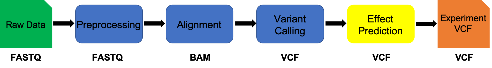

# Variant Annotation (SNPs/INDELs effects)

This document assumes [variant calling](variant_calling.md) has been completed.

**IF** for some reason it didn't finish, is corrupted or you missed the session, you can copy over from the flash drive




## Variant Annotation using SnpEff

We will call annotation our variants (SNPs and indels) using [snpeff](http://snpeff.sourceforge.net/). We will use the output from the prior variant calling step (vcf) as input into snpeff. snpeff produces a new VCF (Variant Call Format) file with variant annotation added in the INFO field.

---
**1\.** First, lets make sure we are where we are supposed to be:

    cd ~/variant_example

**2\.** We will use software called 'snpeff' to annotate the VCF file, lets take a look at the help text:

    snpeff -h


```bash
SnpEff version SnpEff 4.3t (build 2017-11-24 10:18), by Pablo Cingolani
Usage: snpEff [command] [options] [files]

Run 'java -jar snpEff.jar command' for help on each specific command

Available commands:
	[eff|ann]                    : Annotate variants / calculate effects (you can use either 'ann' or 'eff', they mean the same). Default: ann (no command or 'ann').
	build                        : Build a SnpEff database.
	buildNextProt                : Build a SnpEff for NextProt (using NextProt\'s XML files).
	cds                          : Compare CDS sequences calculated form a SnpEff database to the one in a FASTA file. Used for checking databases correctness.
	closest                      : Annotate the closest genomic region.
	count                        : Count how many intervals (from a BAM, BED or VCF file) overlap with each genomic interval.
	databases                    : Show currently available databases (from local config file).
	download                     : Download a SnpEff database.
	dump                         : Dump to STDOUT a SnpEff database (mostly used for debugging).
	genes2bed                    : Create a bed file from a genes list.
	len                          : Calculate total genomic length for each marker type.
	pdb                          : Build interaction database (based on PDB data).
	protein                      : Compare protein sequences calculated form a SnpEff database to the one in a FASTA file. Used for checking databases correctness.
	seq                          : Show sequence (from command line) translation.
	show                         : Show a text representation of genes or transcripts coordiantes, DNA sequence and protein sequence.
	translocReport               : Create a translocations report (from VCF file).

Generic options:
	-c , -config                 : Specify config file
	-configOption name=value     : Override a config file option
	-d , -debug                  : Debug mode (very verbose).
	-dataDir <path>              : Override data_dir parameter from config file.
	-download                    : Download a SnpEff database, if not available locally. Default: true
	-nodownload                  : Do not download a SnpEff database, if not available locally.
	-h , -help                   : Show this help and exit
	-noLog                       : Do not report usage statistics to server
	-t                           : Use multiple threads (implies '-noStats'). Default 'off'
	-q , -quiet                  : Quiet mode (do not show any messages or errors)
	-v , -verbose                : Verbose mode
	-version                     : Show version number and exit

Database options:
	-canon                       : Only use canonical transcripts.
	-canonList <file>            : Only use canonical transcripts, replace some transcripts using the 'gene_id 	 transcript_id' entries in <file>.
	-interaction                 : Annotate using inteactions (requires interaciton database). Default: true
	-interval <file>             : Use a custom intervals in TXT/BED/BigBed/VCF/GFF file (you may use this option many times)
	-maxTSL <TSL_number>         : Only use transcripts having Transcript Support Level lower than <TSL_number>.
	-motif                       : Annotate using motifs (requires Motif database). Default: true
	-nextProt                    : Annotate using NextProt (requires NextProt database).
	-noGenome                    : Do not load any genomic database (e.g. annotate using custom files).
	-noExpandIUB                 : Disable IUB code expansion in input variants
	-noInteraction               : Disable inteaction annotations
	-noMotif                     : Disable motif annotations.
	-noNextProt                  : Disable NextProt annotations.
	-onlyReg                     : Only use regulation tracks.
	-onlyProtein                 : Only use protein coding transcripts. Default: false
	-onlyTr <file.txt>           : Only use the transcripts in this file. Format: One transcript ID per line.
	-reg <name>                  : Regulation track to use (this option can be used add several times).
	-ss , -spliceSiteSize <int>  : Set size for splice sites (donor and acceptor) in bases. Default: 2
	-spliceRegionExonSize <int>  : Set size for splice site region within exons. Default: 3 bases
	-spliceRegionIntronMin <int> : Set minimum number of bases for splice site region within intron. Default: 3 bases
	-spliceRegionIntronMax <int> : Set maximum number of bases for splice site region within intron. Default: 8 bases
	-strict                      : Only use 'validated' transcripts (i.e. sequence has been checked). Default: false
	-ud , -upDownStreamLen <int> : Set upstream downstream interval length (in bases)
```

**3\.** First we need to create an annotation database for our organism

    cd ~/variant_example/Reference
    cp /anaconda3/pkgs/snpeff-4.3.1t-2/share/snpeff-4.3.1t-2/snpEff.config snpEff_edit.config

edit the snpEff_edit.config file using nano, add the genome *Clostridium_baratii_str_Sullivan*,  so that the beginning looks like:

```bash
#-------------------------------------------------------------------------------
#
# SnpEff configuration file
#
#                                                                                                                               Pablo Cingolani
#-------------------------------------------------------------------------------

#---
Clostridium_baratii_str_Sullivan
# Databases are stored here
# E.g.: Information for 'hg19' is stored in data.dir/hg19/
#
# You can use tilde ('~') as first character to refer to your home directory.
# Also, a non-absolute path will be relative to config's file dir
#
#---
data.dir = ./data/
```

edit the end of the file to include the new database

    echo "Clostridium_baratii_str_Sullivan.genome : Clostridium baratii str. Sullivan, complete genome" >> snpEff_edit.config
    echo "    Clostridium_baratii_str_Sullivan.chromosomes : NZ_CP006905.1, NZ_CP006906.1" >> snpEff_edit.config
    echo "    Clostridium_baratii_str_Sullivan.NZ_CP006905.1.codonTable : Bacterial_and_Plant_Plastid" >> snpEff_edit.config
    echo "    Clostridium_baratii_str_Sullivan.NZ_CP006906.1.codonTable : Bacterial_and_Plant_Plastid" >> snpEff_edit.config


We then need to create the proper data directory structure

    cd ~/variant_example/Reference
    mkdir data
    mkdir data/genomes
    mkdir data/Clostridium_baratii_str_Sullivan
    cp GCF_000789395.1_ASM78939v1_genomic.fna data/genomes/Clostridium_baratii_str_Sullivan.fa
    cp GCF_000789395.1_ASM78939v1_genomic.gff data/Clostridium_baratii_str_Sullivan/genes.gff


Finally, build the database


    snpeff build -gff3 -c snpEff_edit.config -v Clostridium_baratii_str_Sullivan


finally run snpEff on our vcf file

    cd ~/variant_example
    snpEff ann  -no-downstream -no-upstream -no-utr  -o vcf -c Reference/snpEff_edit.config Clostridium_baratii_str_Sullivan 03-Freebayes/freebayes.vcf  > 03-Freebayes/freebayes_annotated.vcf


    
