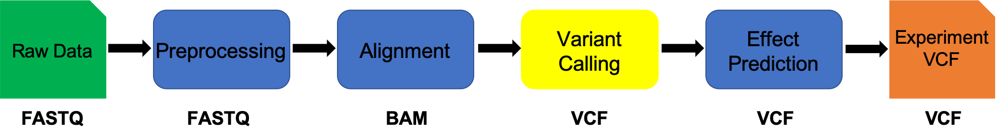

# Variant Calling

This document assumes [alignment](../data_reduction/alignment_Variants.md) has been completed.

**IF** for some reason it didn't finish, is corrupted or you missed the session, you can copy over from the flash drive



## Variant Calling using Freebayes

We will call short variants (SNPs and indels) using [freebayes](https://github.com/ekg/freebayes). We will use the output from the prior alignment step as input into the freebayes. freebayes produces a VCF (Variant Call Format) file with genotype information for every variant across all the samples within an experiment.

---
**1\.** First, lets make sure we are where we are supposed to be:

    cd ~/variant_example

**3\.** Now we will use software called 'freebayes' to find SNPs and short indels. Load the module and take a look at the help text:

    freebayes -h | less

Freebayes has many options, but we are going to run with the defaults. The help text is long so I'm not going to paste it here but rather we pipe to `less` to read it.


    cd ~/variant_example  # We'll run this from the main directory
    wget https://raw.githubusercontent.com/ucdavis-bioinformatics-training/2019-Alliance-for-Global-Health-and-Science-Makerere-University_Variants/master/scripts/freebayes_wks_Variant.sh

    cat freebayes_wks_Variant.sh  

```bash
#!/bin/bash

## assumes freebayes is available on the Path

start=`date +%s`
echo $HOSTNAME

outpath='03-Freebayes'
[[ -d ${outpath} ]] || mkdir ${outpath}

outfile=${outpath}/freebayes.vcf

mapfasta=./Reference/GCF_000789395.1_ASM78939v1_genomic.fna

BAMLIST="bamlist.txt"

call="freebayes \
  --bam-list ${BAMLIST} \
  --fasta-reference ${mapfasta} \
  --vcf  ${outfile} \
  --ploidy 1"

echo $call
eval $call

end=`date +%s`

runtime=$((end-start))

echo $runtime
```

freebayes can use, as input, a text file containing a list of BAMs to analyze (the "-L" option). You will need to create this text file before you can run the script:

    ls 02-BWA/*/*.bam > bamlist.txt

Check the file and make sure it looks right:


    cat bamlist.txt


There should be 15 files. Now, run the script using sbatch:


    bash freebayes_wks_Variants.sh > scriptout/freebayes.out 2> scriptout/freebayes.err

    ## Quality Assurance - Mapping statistics as QA/QC.

    **1\.** Once your jobs have finished successfully (check the error and out logs like we did in the previous exercise), use a script of ours, [star_stats.sh](../scripts/star_stats.sh) to collect the alignment stats. Don't worry about the script's contents at the moment. For now:

        cd ~/variant_example  # We'll run this from the main directory
        wget https://raw.githubusercontent.com/ucdavis-bioinformatics-training/2019-Alliance-for-Global-Health-and-Science-Makerere-University_Variants/master/scripts/bwa_stats_wks_Variants.R

        R CMD BATCH bwa_stats_wks_Variants.R
        cat bwa_stats.txt

    Open in excel (or excel like application), you may have to move the header column 1 cell to the right, and lets review.

    Are all samples behaving similarly? Discuss ...


    Once we are satisfied the data look good, lets remove the pre-merged bam files that at in pe and se.


    cd ~/variant_example  # We'll run this from the main directory
    rm -rf 02-BWA/*/*-pe 02-BWA/*/*-se


    bcftools stats 03-Freebayes/freebayes.vcf > freebayes_stats.txt

## Scripts

shell script for running freebayes

[freebayes_wks_Variants.sh](../scripts/freebayes_wks_Variants.sh)
