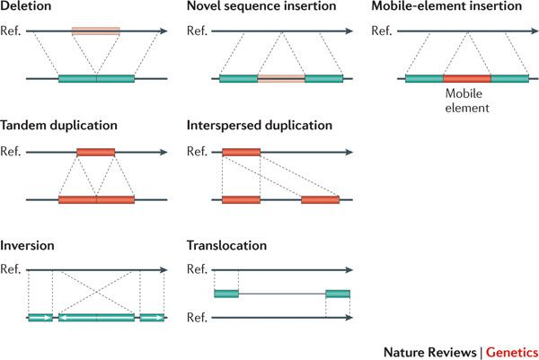

# Variant Calling

This document assumes [alignment](../data_reduction/alignment_Variants.md) has been completed.

**IF** for some reason it didn't finish, is corrupted or you missed the session, you can copy over from the flash drive



Can Alkan, Bradley P. Coe & Evan E. Eichler. "Genome structural variation discovery and genotyping" Nature Reviews Genetics volume 12, pages 363–376 (2011)

### Haplotype Calling


## Variant Calling using Freebayes

We will call short variants (SNPs and indels) using [freebayes](https://github.com/ekg/freebayes). We will use the output from the prior alignment step as input into the freebayes. freebayes produces a VCF (Variant Call Format) file with genotype information for every variant across all the samples within an experiment.

---
**1\.** First, lets make sure we are where we are supposed to be:

    cd ~/variant_example

**3\.** Now we will use software called 'freebayes' to find SNPs and short indels. Load the module and take a look at the help text:

    freebayes -h | less

Freebayes has many options, and the help text is long so I'm not going to paste it here but rather we pipe to `less` to read it.


    cd ~/variant_example
    curl https://raw.githubusercontent.com/ucdavis-bioinformatics-training/2019-Alliance-for-Global-Health-and-Science-Makerere-University_Variants/master/scripts/freebayes_wks_Variant.sh > freebayes_wks_Variant.sh

    cat freebayes_wks_Variant.sh  

We are going to run freebayes mostly with the defaults. What non-default parameter do we use and why?

```bash
#!/bin/bash

## assumes freebayes is available on the Path

start=`date +%s`
echo $HOSTNAME

outpath='03-Freebayes'
[[ -d ${outpath} ]] || mkdir ${outpath}

outfile=${outpath}/freebayes.vcf

mapfasta=./Reference/GCF_000789395.1_ASM78939v1_genomic.fna

BAMLIST="bamlist.txt"

call="freebayes \
  --bam-list ${BAMLIST} \
  --fasta-reference ${mapfasta} \
  --vcf  ${outfile} \
  --ploidy 1"

echo $call
eval $call

end=`date +%s`

runtime=$((end-start))

echo $runtime
```

freebayes can use, as input, a text file containing a list of BAMs to analyze (the "-L" option). You will need to create this text file before you can run the script:

    ls 02-BWA/*/*.bam > bamlist.txt

Check the file and make sure it looks right:


    cat bamlist.txt


There should be 15 bam files in bamlist.txt. Now, run the script:


    bash freebayes_wks_Variants.sh > scriptout/freebayes.out 2> scriptout/freebayes.err


## Quality Assurance - bcftools stats.

**1\.** Once the job have finished successfully (check the error and out logs like we did in the previous exercise), then we will run *bcltools stats* to collect the variant calling stats:

    cd ~/variant_example  # We'll run this from the main directory
    bcftools stats 03-Freebayes/freebayes.vcf > freebayes_stats.txt
    less freebayes_stats.txt

## Scripts

shell script for running freebayes

[freebayes_wks_Variants.sh](../scripts/freebayes_wks_Variants.sh)
