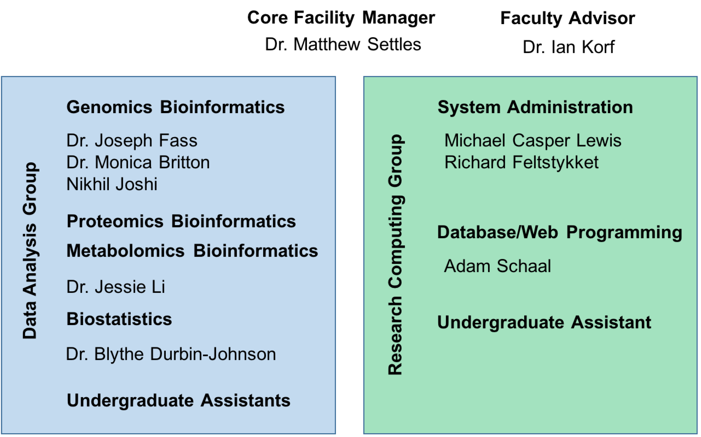
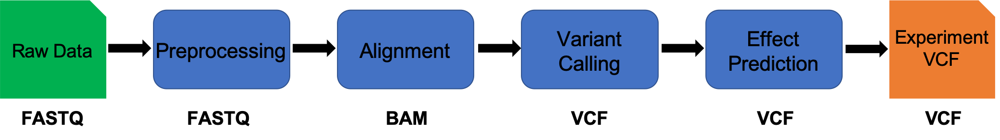

# Quick Introduction to the Workshop and Core

__The mission of the Bioinformatics Core facility is to facilitate outstanding omics-scale research through these activities:__

 

## Staff

 

## Contacts

* Bioinformatics related questions, include but not limited to bioinformatic methods questions, software use, data questions.
  * Bioinformatics.core@ucdavis.edu
* Computing Issues, include but not limited to user account questions, equipment failure/malfunction, software install, software failures (not related to use)
  * helpdesk@genomecenter.ucdavis.edu
* Training courses information
  * training.bioinformatics@ucdavis.edu

## Workshop Goals

* End to End understanding of Variant Analysis
  * Discussions/lectures
  * Technologies
  * Experimental design
  * Cost estimation
  * Workflow

* To work through a complete experiment, starting from raw data to completion, including making a few figures.
* Goal is 30-40% lecture/discussion 60-70% hands-on

## Workshop Materials

Workshop materials are all posted on github, and publicly available

http://bioinformatics.ucdavis.edu/training/events/

* Github main page:

	https://github.com/ucdavis-bioinformatics-training

* This Workshop

  https://ucdavis-bioinformatics-training.github.io/2019-Alliance-for-Global-Health-and-Science-Makerere-University_Variants

  https://github.com/ucdavis-bioinformatics-training/2019-Alliance-for-Global-Health-and-Science-Makerere-University_Variants
